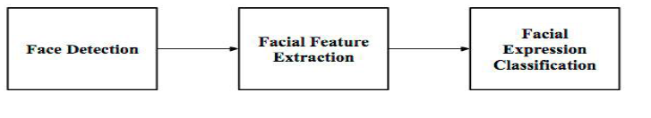

# EmotionRecon:
## Introduction:

I created this project as my Bachelor's degree graduation project with the aim of providing assistance to students and teachers amidst the COVID-19 crisis.
 
EmotionRecon, is designed to aid teachers in gauging students' understanding of lesson concepts by analyzing their emotions in real-time throughout the entire lesson using a TCP connection.

## Implementation of EmotionRecon:
EmotionRecon is based on three important phases :
 

 
- *Phase 1*: **Face Detection** 
The student's face is identified using a machine learning algorithm called the Haar Cascade classifier, which employs pattern recognition techniques. To delve deeper into the Haar Cascade method, you can refer to the research paper authored by Paul Viola and Michael Jones : [Rapid Object Detection using a Boosted Cascade of Simple
Features
](https://www.cs.cmu.edu/~efros/courses/LBMV07/Papers/viola-cvpr-01.pdf). The paper contains detailed information about the approach and its workings. 
  
- *Phase 2*: **Facial Feature Extraction** 
To detect the emotion of the student, I employed a Deep Learning model with a Transfer Learning approach, specifically using a Residual Neural Network (ResNet50).  The ResNet50 model is pre-trained on a large dataset and is known for its ability to extract and learn the most discriminative features from the face.  This transfer learning technique allows the model to leverage its prior knowledge from the pre-training to better recognize and classify emotions in students' faces effectively. By fine-tuning the ResNet50 model on our specific emotion detection task, we can achieve higher accuracy and efficiency in detecting emotions during real-time lessons.

- *Phase 3* : **Facial Feature Extraction** 
During this phase, we classify the emotion obtained by the model.

## Results:
For the emotion classification task, the model obtained a result of 71% during the test phase.
## Features of EmotionRecon:
### Chat space : 
Through a chat space, the teacher gains the ability to monitor the real-time emotions of their students.
 
### Login Interface:
Either the student or the teacher can connect to their account.
### Sign Up Interface:
A user have the possiblity to create his account.
